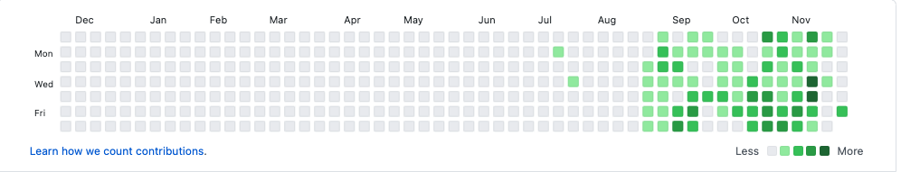

# JS-Portfolio-gt

# Commits for 2020

## Responsive Portfolio

Responsive design ensures that web applications render well on a variety of devices and window or screen sizes or to create a mobile-first application or add responsive design to an existing application.
## Description 

explain and showcase what your application does, justify the technologies used, and even talk about some of the challenges you faced and features you hope to implement in the future.

At a minimum, your project README needs a title and a short description explaining the what, why, and how. What was your motivation? Why did you build this project? (Note: The answer is not "Because it was a homework assignment.") What problem does it solve? What did you learn? What makes your project stand out? If your project has a lot of features, consider adding a heading called "Features" and listing them here.

First, you will use the Bootstrap CSS Framework to create a mobile responsive portfolio. How do you deliver this? Here are some guidelines:

* Create the following files files: `index.html`, `portfolio.html` and `contact.html`.

* Using Bootstrap, develop your portfolio site with the following items:

   * A navbar

   * A responsive layout

   * Responsive images

* The Bootstrap portfolio minimizes the use of media queries.

* Screenshots are provided as a reference in the `Assets/Images` folder. Use Bootstrap to create a similar, responsive layout.

* **Application registration page**
    Add-on.

    Forms on the internet can be quite boring, so use this as an opportunity to re-imagine what a form should look like! Your registration page should include inputs for first name, last name, email (which validates as an email address), password (which should be obscured), confirm password (again, obscure it), and a submit button. Feel free to add any other items you can think of!

* **Google Search clone**

    Using HTML and CSS, see if you can re-create the design of the Google search page. We're just going for the visual here; it doesn't need to be a functional search form.

## User Story

Part of being a developer is putting yourself in the shoes of your audience and imagining their experience with the application you’re creating. 

A user story, or persona, is a description of an application using natural, non-technical language. Written from the perspective of the application’s end user, they help developers organize their work by allowing them to understand an application’s context and who will be using it.

## Overview
When web developers find themselves repeating a task, they often look for programmatic solutions. A prime example is setting up boilerplate HTML and CSS that can be reused. In the previous unit, you built and deployed a simple portfolio site. Now imagine that you're building portfolios for several clients. An efficient approach to this scenario would be to create a master stylesheet and then customize copies of it for each portfolio. In doing so, you'd be implementing a simple CSS framework. 

CSS frameworks allow us to quickly style a web application so we can focus on **bootstrapping** it (i.e., building and deploying the business logic). Most CSS frameworks handle the more challenging aspects of CSS for us, such as floats and media queries. Another benefit of using CSS frameworks is that it ensures consistency across applications. Depending on your career trajectory, you may find yourself maintaining multiple web applications and, as you learned in the previous unit, CSS can get unruly very quickly. As applications scale, being able to easily maintain and organize your codebase becomes very important.

The CSS framework we'll use in this course is Bootstrap. Bootstrap was one of the first CSS frameworks and is, at the time of this writing, the most widely used in production. It was created by the developers at Twitter for the reasons discussed above and released as an open source project in 2011, meaning anyone could use it in their applications for free. There are dozens of CSS frameworks to choose from now. Learning Bootstrap will set you up to quickly adapt to almost any framework as they tend to share the same underlying concept of a grid system structured by rows and columns.

## Mock-up Demonstration of App Function

## Criteria
### Acceptance criteria 

* Functional, deployed application

* GitHub repository with README describing the project

* Navbar must be consistent on each page.

* Navbar on each page must contain links to Home/About, Contact, and Portfolio pages.

* All links must work.

* Must use semantic html.

* Each page must have valid and correct HTML. (use a validation service)

* Must contain your personalized information. (bio, name, images, links to social media, etc.)

* Must properly utilize Bootstrap components and grid system.

* Use Bootstrap's grid system (containers, rows, and columns).

* On an `xs` screen, content should take up the entire screen. On `sm` and larger screens, you should have some margins on the left and right sides of the screen. Check out various sites on your mobile device vs. your computer to see examples of these differences.

* Use an HTML validation service to ensure that each page has valid HTML.

### Bonus

* Using Bootstrap, make a sticky footer and use sub-rows and sub-columns on your portfolio site (**Hint:** Check out the Bootstrap documentation).

## Review

In the real world, when a developer finishes working on an issue, another developer reviews the code, providing feedback on errors and making sure that all of the acceptance criteria have been met. For the homework assignments, your TAs will serve as your reviewers.

To submit your application for review, you are required to provide the following:

* The URL of the deployed application.

* The URL of the GitHub repository. Give the repository a unique name and include a README describing the project.

### Quiz to Myself:
* Which browsers support HTML5?

* Which two attributes should every  tag should have?

* What's the difference between a class selector and an id selector?

* Why is it preferable to use external style sheets instead of inline CSS?

* What are the advantages of using Git?

Employer-Ready Questions:

1. What is a CDN?
2. What is a CSS framework?
3. What are three benefits of using a CSS framework?

You will be employer-competitive if you are able to:

* Explain the importance of CSS resets and cross-browser compatibility
* Explain and implement content delivery network links in HTML files
* Implement a grid layout in HTML to leverage the benefits of a CSS framework
* Integrate Bootstrap components in HTML files to quickly build user interfaces
* Add custom styling to a CSS framework
* Deploy to GitHub pages

*   **Where can styles be defined?**

    * Inline&mdash;used to style only a small piece of code: `
 This is a section 
`

    * Embedded&mdash;style sheets are put inside the `<head>` element in between the ``

    * External&mdash;style rules are defined in a separate file and linked from the HTML file using `<link rel="stylesheet" type="text/css" href="./assets/css/app.css" />`

*   **What is a selector and what are the different types of selectors you can use?**

    A selector is used to select an element and apply styles to it. Here's a list of selectors: 

     * Class: `.someClass { color: red }`
     * ID: `#someId { color: red }`
     * Type: `p{ color: red }`
     * Attribute: `p[href="https://myportfolio.com"] { color: red }`
     * Pseudo-class: `div:first-child { color: red }`
     * Pseudo-element: `div::after { height: 300px; }`

*   **What are the advantages of external style sheets?**

    * Classes can be reused in multiple style sheets and HTML documents.

    * You can control multiple styles from one source of truth (i.e., one CSS document).

*   **Is there anything you dislike about CSS?**

    This one doesn't have a right or wrong answer. Developers have opinions, and prospective employers want to know that you do too. List two or three things you found difficult or irritating about learning CSS, and describe how you overcame those.

## Key Topics
The following topics will be covered in this unit:
* Developer tools
* CSS resets
* Typography
* Pseudo-classes
* !important
* Media queries
* Viewport tag
* CDN
* Bootstrap
* Bootstrap components
  * Bootstrap predefined classes
  * Bootstrap rows, columns, and containers
  * Bootstrap grids
* GitHub Pages

## Table of Contents (Optional)

If your README is very long, add a table of contents to make it easy for users to find what they need.

* [Description](#description)
* [User Story](#user_story)
* [Criteria](#Criteria)
* [Review](#review)
* [Installation](#installation)
* [Usage](#usage)
* [Credits](#credits)
* [License](#license)

## Installation

What are the steps required to install your project? Provide a step-by-step description of how to get the development environment running.

## Usage 

Provide instructions and examples for use. Include screenshots as needed. 

## Credits

List your collaborators, if any, with links to their GitHub profiles.

If you used any third-party assets that require attribution, list the creators with links to their primary web presence in this section.

If you followed tutorials, include links to those here as well.

## License

The last section of a good README is a license. This lets other developers know what they can and cannot do with your project. If you need help choosing a license, use [https://choosealicense.com/](https://choosealicense.com/)

---

🏆 The sections listed above are the minimum for a good README, but your project will ultimately determine the content of this document. You might also want to consider adding the following sections.

## Badges

<!--  -->

Badges aren't _necessary_, per se, but they demonstrate street cred. Badges let other developers know that you know what you're doing. Check out the badges hosted by [shields.io](https://shields.io/). You may not understand what they all represent now, but you will in time.

## Contributing

If you created an application or package and would like other developers to contribute it, you will want to add guidelines for how to do so. The [Contributor Covenant](https://www.contributor-covenant.org/) is an industry standard, but you can always write your own.

## Tests

Go the extra mile and write tests for your application. Then provide examples on how to run them.

## Helpful Links to help use the Bootstrap CSS Framework to recreate your portfolio.

* [CSS frameworks](https://en.wikipedia.org/wiki/CSS_framework)
* [Bootstrap Official Docs](https://getbootstrap.com/)
* [Bootstrap Components](https://getbootstrap.com/docs/4.3/components/alerts/)
* [!important](https://developer.mozilla.org/en-US/docs/Web/CSS/Specificity)
* [CDN (wikipedia)](https://en.wikipedia.org/wiki/Content_delivery_network)
* [GitHub Pages](https://pages.github.com/)

- - -
© 2020 Vincent Kendrick Portfolio. All Rights Reserved.

---