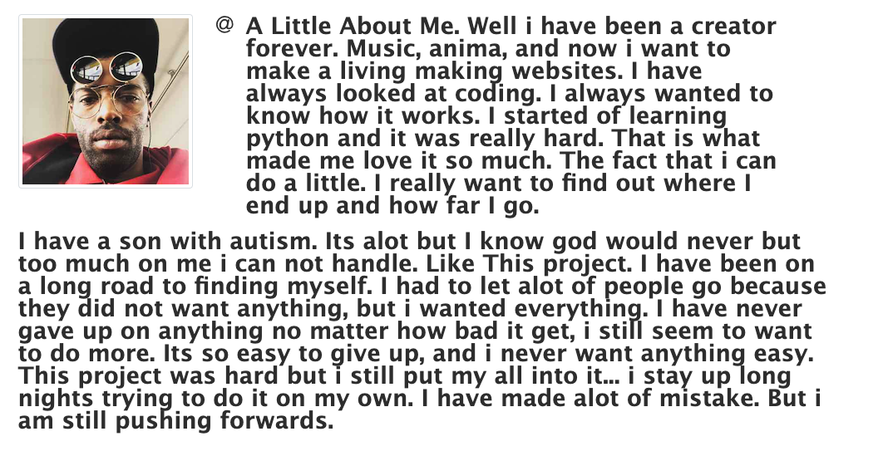
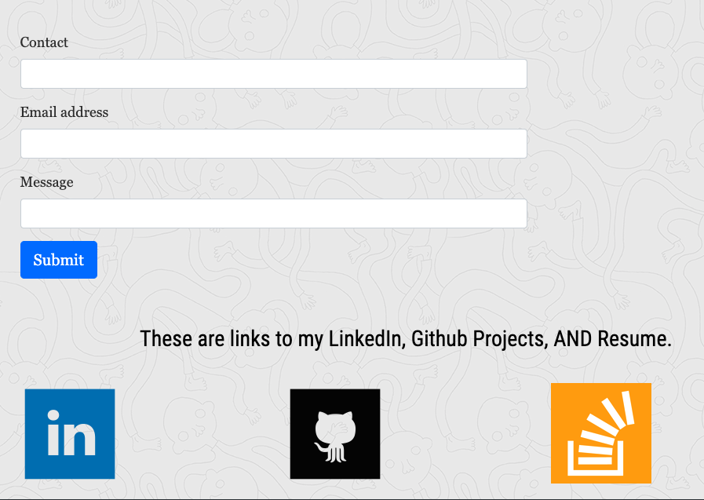
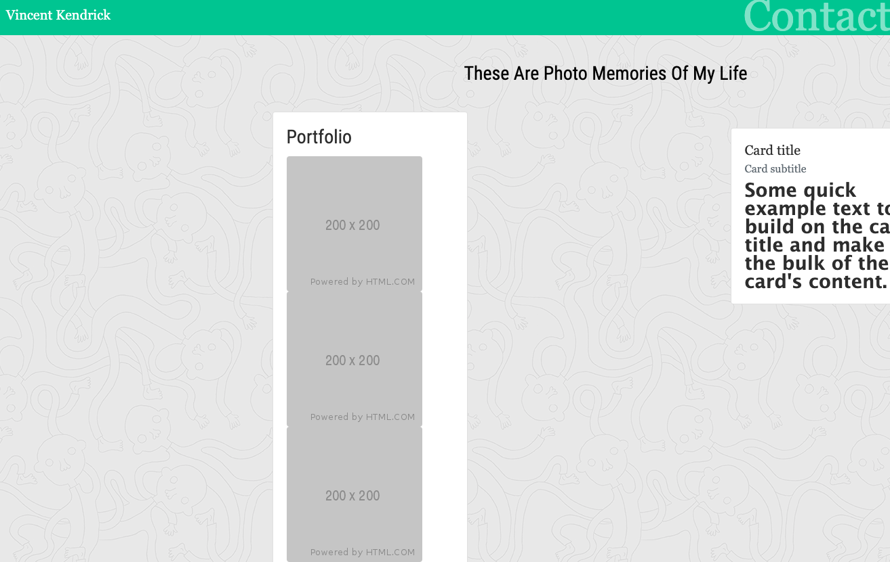
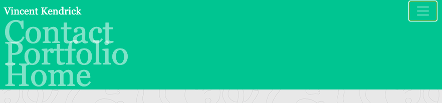

# CSS-Bootstrap-Portfolio-gt

<!-- https://dagreatcode.github.io/CSS-Bootstrap-Portfolio-gt/ -->

Needs Local Storage and MySql2 Sequelize, also run `​sequelize init:config &sequelize init:models` do not use nodemon 

<!--  -->

# Commits from 2020

## Responsive Portfolio

Responsive design ensures that web applications render well on a variety of devices and window or screen sizes or to create a mobile-first application or add responsive design to an existing application.

## Description

This is my first portfolio out of three. I made this one with HTML, CSS, Bootstrap. I wanted to go all out with these three skills so the it can become second nature, and so I made a portfolio to show those skills. I learned that if you are lazy in this area, it will show. I wanted to make a portfolio that shows off the bootstrap, css, and html only. There are updates always to come.

- **Application registration page**
  Add-on.

  This is where I am thinking about taking in info for work or connect it to my phone with twilio and cron.

  

- **Challenges faced**
  One challenge was thinking that CSS was a joke. 
  My Future Ideas is to see what more is there to CSS, and Bootstrap.

## User Story

I want a app the can showcase all my work and contacts and also my resume all in one site.

## Overview

CSS frameworks allow us to quickly style a web application so we can focus on **bootstrapping** it (i.e., building and deploying the business logic). Most CSS frameworks handle the more challenging aspects of CSS for us, such as floats and media queries.

Bootstrap was one of the first CSS frameworks. It was created by the developers at Twitter for the reasons discussed above and released as an open source project in 2011.
## Mock-up Demonstration of App Function

- The Bootstrap portfolio minimizes the use of media queries.

### Quiz:

- Which browsers support HTML5?

- Which two attributes should every  tag should have?

- What's the difference between a class selector and an id selector?

- Why is it preferable to use external style sheets instead of inline CSS?

- What are the advantages of using Git?

Employer-Ready Questions:

1. What is a CDN?
2. What is a CSS framework?
3. What are three benefits of using a CSS framework?

You will be employer-competitive if you are able to:

- Explain the importance of CSS resets and cross-browser compatibility
- Explain and implement content delivery network links in HTML files
- Implement a grid layout in HTML to leverage the benefits of a CSS framework
- Integrate Bootstrap components in HTML files to quickly build user interfaces
- Add custom styling to a CSS framework
- Deploy to GitHub pages

- **Where can styles be defined?**

  - Inline&mdash;used to style only a small piece of code: `
 This is a section 
`

  - Embedded&mdash;style sheets are put inside the `<head>` element in between the ``

  - External&mdash;style rules are defined in a separate file and linked from the HTML file using `<link rel="stylesheet" type="text/css" href="./assets/css/app.css" />`

- **What is a selector and what are the different types of selectors you can use?**

  A selector is used to select an element and apply styles to it. Here's a list of selectors:

  - Class: `.someClass { color: red }`
  - ID: `#someId { color: red }`
  - Type: `p{ color: red }`
  - Attribute: `p[href="https://myportfolio.com"] { color: red }`
  - Pseudo-class: `div:first-child { color: red }`
  - Pseudo-element: `div::after { height: 300px; }`

- **What are the advantages of external style sheets?**

  - Classes can be reused in multiple style sheets and HTML documents.

  - You can control multiple styles from one source of truth (i.e., one CSS document).

- **Is there anything you dislike about CSS?**

  This one doesn't have a right or wrong answer. Developers have opinions, and prospective employers want to know that you do too. List two or three things you found difficult or irritating about learning CSS, and describe how you overcame those.

## Key Topics

- Developer tools
- CSS resets
- Typography
- Pseudo-classes
- !important
- Media queries
- Viewport tag
- CDN
- Bootstrap
- Bootstrap components
  - Bootstrap predefined classes
  - Bootstrap rows, columns, and containers
  - Bootstrap grids
- GitHub Pages

## Table of Contents

If your README is very long, add a table of contents to make it easy for users to find what they need.

- [Description](#description)
- [Overview](#overview)
- [Quiz](#Quiz)
- [Usage](#usage)
- [Credits](#credits)
- [License](#license)

## Credits

Georgia Tech Boot Camp

## License

<!--  -->

https://www.linkedin.com/in/vincent-kendrick-baab171b2/

 

https://github.com/dagreatcode

<!-- Badges aren't _necessary_, per se, but they demonstrate street cred. Badges let other developers know that you know what you're doing. Check out the badges hosted by [shields.io](https://shields.io/). You may not understand what they all represent now, but you will in time. -->

## Helpful Links to help use the Bootstrap CSS Framework to recreate your portfolio.

- [CSS frameworks](https://en.wikipedia.org/wiki/CSS_framework)
- [Bootstrap Official Docs](https://getbootstrap.com/)
- [Bootstrap Components](https://getbootstrap.com/docs/4.3/components/alerts/)
- [!important](https://developer.mozilla.org/en-US/docs/Web/CSS/Specificity)
- [CDN (wikipedia)](https://en.wikipedia.org/wiki/Content_delivery_network)
- [GitHub Pages](https://pages.github.com/)

---

© 2020 Vincent Kendrick Portfolio. All Rights Reserved.

---
